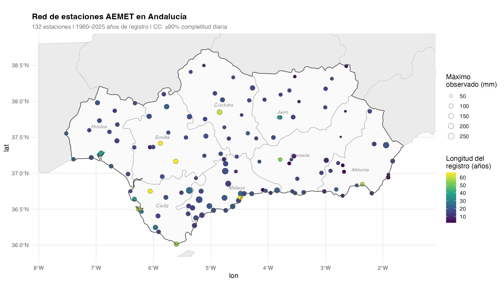
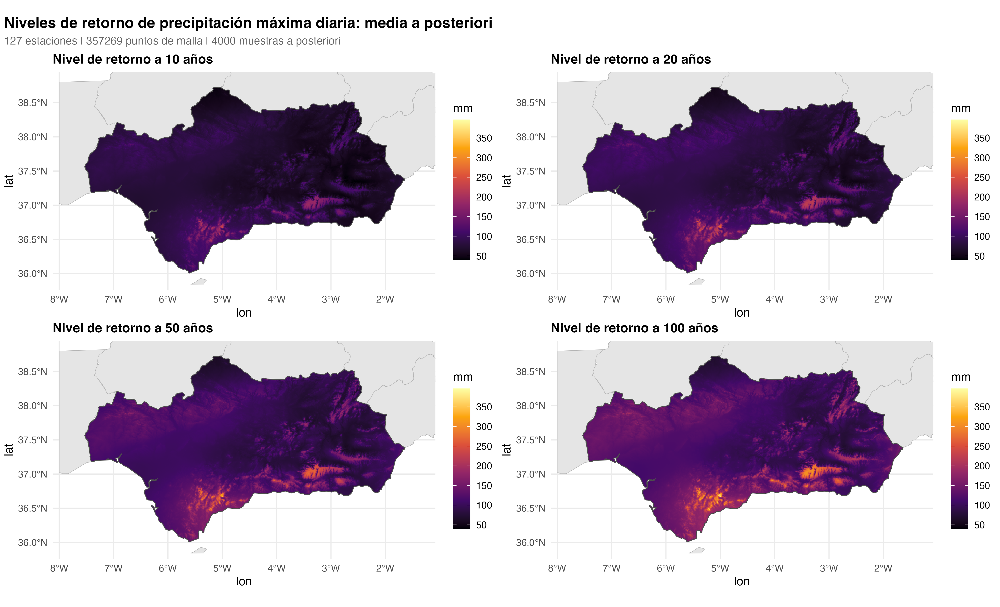
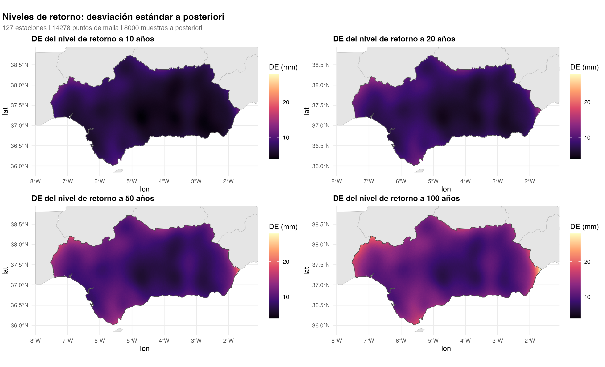
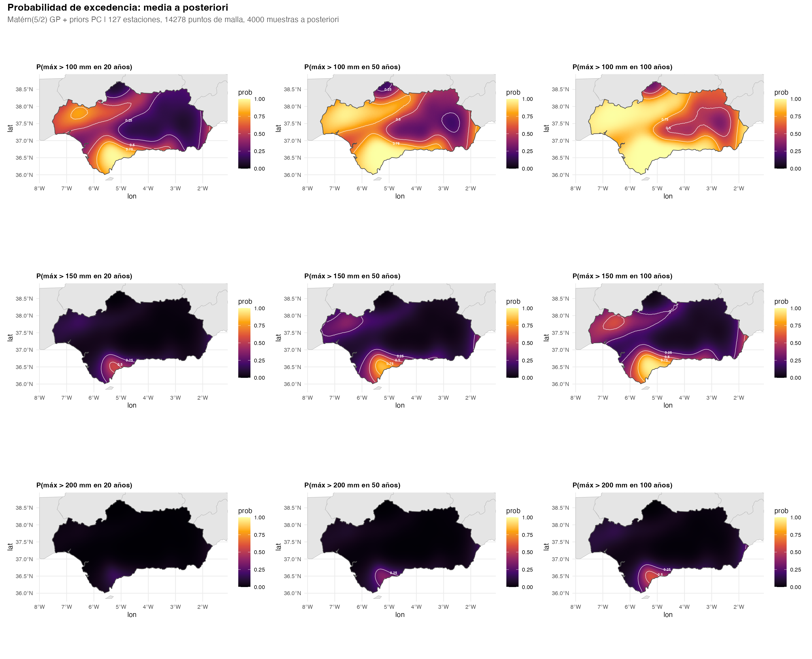
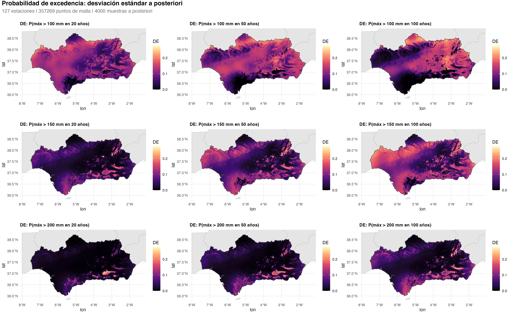
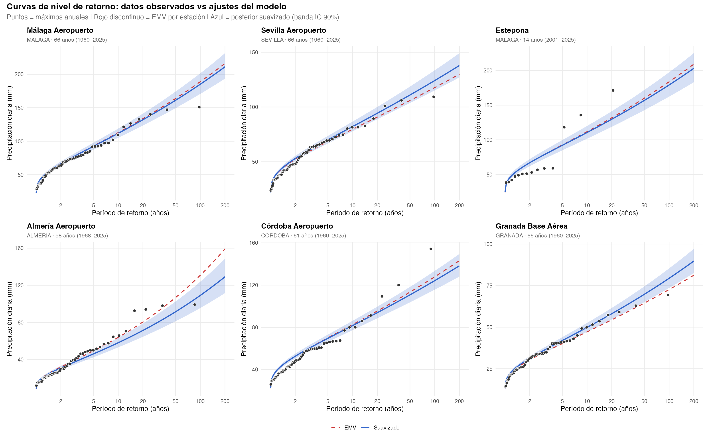

[🇬🇧 English](README.md) | 🇪🇸 Español

# Precipitación extrema espacial en Andalucía

Análisis bayesiano espacial de valores extremos de precipitación diaria en Andalucía, España, utilizando el marco de dos etapas **Max-and-Smooth** con suavizado espacial mediante procesos gaussianos con covarianza Matérn(5/2) y priors de complejidad penalizada (PC).

## Introducción

La precipitación diaria extrema es un dato clave para la evaluación del riesgo de inundaciones, el diseño de infraestructuras y la planificación de recursos hídricos. Estimar la rareza de un evento de lluvia determinado — y cómo esa rareza varía en el espacio — requiere ajustar modelos estadísticos a los datos observados. Cuando los registros de estaciones individuales son cortos o escasos, las estimaciones estación por estación pueden ser ruidosas y espacialmente inconsistentes.

El objetivo de este proyecto es proporcionar estimaciones espacialmente continuas de **niveles de retorno** (la cantidad de precipitación que se espera superar en promedio una vez cada *T* años) y **probabilidades de excedencia** (la probabilidad de superar un umbral crítico dentro de un horizonte de planificación) en toda Andalucía, como apoyo a la evaluación del riesgo de inundaciones y la planificación hidrológica en la región. Utilizando registros de precipitación diaria de 127 estaciones de AEMET, el marco de dos etapas **Max-and-Smooth** (Hrafnkelsson et al., 2021) ajusta una distribución GEV en cada estación de forma independiente y luego comparte información entre estaciones a través de un prior de proceso gaussiano Matérn, produciendo mapas espacialmente coherentes con cuantificación completa de la incertidumbre.

## Datos

- **Fuente**: API OpenData de AEMET (Agencia Estatal de Meteorología)
- **Cobertura**: 127 estaciones en las 8 provincias de Andalucía
- **Período**: 1950–2024 (varía por estación; la longitud mínima del registro se compensa con el préstamo bayesiano de fuerza)
- **CC**: Los años-estación requieren ≥90% de completitud diaria (≥330 días/año)



## Método

El análisis sigue el enfoque **Max-and-Smooth** de Hrafnkelsson et al. (2021) tal como se presenta en Hazra, Huser & Jóhannesson (2023, Cap. 7). La precipitación máxima diaria anual en cada estación se modela con una distribución generalizada de valores extremos (GEV) cuyos parámetros varían suavemente en el espacio a través de priors de procesos gaussianos.

### Modelo GEV y reparametrización

La función de distribución GEV es

$$F(z) = \exp\left[-\left(1 + \xi \left(\frac{z - \mu}{\sigma}\right)\right)^{-1/\xi}\right]$$

con localización $\mu$, escala $\sigma > 0$ y forma $\xi$. Los parámetros se reparametrizan como

$$(\psi, \tau, \phi) = (\log(\mu), \log(\sigma / \mu), h(\xi))$$

donde $h$ es una biyección suave que mapea $\xi \in (-0.5, 0.5)$ a la recta real:

$$h(\xi) = a + b \cdot \log(-\log(1 - u^c)),\quad u = \frac{\xi - \xi_{\min}}{\xi_{\max} - \xi_{\min}}$$

con constantes $c = 0.8$, $a$ y $b$ elegidos para que $h(0) \approx 0$. Esto asegura que los tres parámetros de trabajo sean no acotados, lo cual es esencial para la verosimilitud sustituta gaussiana y el prior GP en la Etapa 2.

### Etapa 1 — Máxima verosimilitud por estación

En cada estación se maximiza una verosimilitud de proceso puntual de Poisson (PPP) sobre las observaciones diarias que superan un umbral específico por estación (el percentil 75 de la precipitación positiva). La optimización multi-inicio con cinco valores iniciales de forma evita óptimos locales, prefiriendo soluciones interiores ($\xi$ lejos de los límites) para asegurar hessianos fiables.

Un bootstrap paramétrico (1000 réplicas por estación) proporciona matrices de covarianza 3 × 3 por estación $\hat\Sigma_i$ para la verosimilitud sustituta gaussiana de la Etapa 2. Se simulan excedencias del modelo PPP ajustado y se re-estiman, obteniendo las covarianzas empíricas del EMV entre réplicas.

### Etapa 2 — Suavizado espacial

Las estimaciones de la Etapa 1 $\hat\eta_i = (\hat\psi_i, \hat\tau_i, \hat\phi_i)$ se tratan como observaciones ruidosas de un campo espacial latente. Para cada uno de los tres parámetros GEV, se coloca un prior de proceso gaussiano independiente sobre los valores latentes:

$$\eta_k \sim \text{GP}(\mu_k, C_k)$$

con covarianza Matérn de suavidad 5/2:

$$C_k(d) = \sigma_k^2 \left(1 + \frac{\sqrt{5} d}{\rho_k} + \frac{5 d^2}{3 \rho_k^2}\right) \exp\left(-\frac{\sqrt{5} d}{\rho_k}\right)$$

donde $d$ es la distancia entre estaciones (en grados), $\sigma_k$ es la desviación estándar marginal y $\rho_k$ es el rango práctico. Un término nugget $\nu_k^2$ se añade a la diagonal para absorber el ruido específico de cada estación no capturado por el GP espacial.

#### Verosimilitud sustituta

Las covarianzas bootstrap de la Etapa 1 forman una matriz de precisión diagonal por bloques $Q$ con bloques 3 × 3 $\hat\Sigma_i^{-1}$. La verosimilitud sustituta es

$$\hat{\eta} \mid \eta \sim \mathcal{N}(\eta, Q^{-1})$$

lo que desacopla los costosos ajustes PPP por estación del suavizado espacial.

#### Parametrización no centrada

Para mejorar la eficiencia del muestreo HMC, el GP se parametriza como $\eta_k = \mu_k + L_k z_k$, donde $L_k$ es el factor de Cholesky de la matriz de covarianza y $z_k \sim \mathcal{N}(0, I)$.

#### Priors de complejidad penalizada

Siguiendo a Fuglstad et al. (2019), los hiperparámetros del GP reciben priors PC. Los GPs de $\psi$ y $\tau$ comparten una calibración; el GP de $\phi$ recibe priors más estrictos que reflejan la menor variación espacial del parámetro de forma:

| Parámetro | $\psi$, $\tau$ | $\phi$ |
|-----------|----------------|--------|
| $\sigma_k$ (DE marginal) | $P(\sigma > 1) = 0.05 \Rightarrow \lambda_\sigma = 3.0$ | $P(\sigma > 0.3) = 0.05 \Rightarrow \lambda_\sigma = 10.0$ |
| $\rho_k$ (rango) | $P(\rho < 0.1°) = 0.05 \Rightarrow \lambda_\rho = 0.30$ | $P(\rho < 0.5°) = 0.05 \Rightarrow \lambda_\rho = 1.50$ |
| $\nu_k$ (DE nugget) | $P(\nu > 0.5) = 0.05 \Rightarrow \lambda_\nu = 6.0$ | $P(\nu > 0.3) = 0.05 \Rightarrow \lambda_\nu = 10.0$ |

Los coeficientes de covariables $\boldsymbol\beta_\psi$ reciben priors vagos $\mathcal{N}(0, 10^2)$; los interceptos $\mu_\tau$ y $\mu_\phi$ reciben $\mathcal{N}(0, 100^2)$. El modelo se ajusta conjuntamente en Stan (Carpenter et al., 2017) usando NUTS con 4 cadenas × 2000 iteraciones (1000 calentamiento), `adapt_delta = 0.9`.

### Predicción

Los niveles de retorno y las probabilidades de excedencia en ubicaciones no observadas se obtienen de la **distribución condicional del GP Matérn**. Los hiperparámetros del GP $(\hat\sigma_k, \hat\rho_k, \hat\nu_k)$ se fijan en sus medias a posteriori para calcular los momentos condicionales en una ubicación de predicción $s^*$:

$$\eta_k(s^*) \mid \eta_k \sim \mathcal{N}(\mu_{\text{cond}}, \sigma^2_{\text{cond}})$$

donde

$$\mu_{\text{cond}} = \mu_k + \gamma_k^\top \Sigma_k^{-1} (\eta_k - \mu_k), \qquad \sigma^2_{\text{cond}} = \sigma_k^2 - \gamma_k^\top \Sigma_k^{-1} \gamma_k$$

con $\gamma_k$ el vector de covarianza cruzada entre $s^*$ y las estaciones, y $\Sigma_k$ la matriz de covarianza estación-estación (incluyendo nugget). Para cada muestra a posteriori del campo latente $\eta_k$, se **muestrea** una predicción de esta distribución condicional, por lo que la incertidumbre de interpolación $\sigma^2_{\text{cond}}$ se propaga completamente a los niveles de retorno predictivos a posteriori. Las predicciones se calculan en una malla de 0.005° (~500 m) sobre Andalucía.

## Resultados

### Mapas de niveles de retorno

Media a posteriori de los niveles de retorno para *T* = 10, 20, 50 y 100 años, interpolados sobre Andalucía en una malla de 0.005° (~500 m).



Desviación estándar a posteriori de las estimaciones de niveles de retorno, reflejando la incertidumbre tanto de la estimación de parámetros GEV como de la interpolación espacial.



### Probabilidad de excedencia

Media a posteriori de la probabilidad de que la precipitación máxima diaria anual supere un umbral dado (100, 150, 200 mm) al menos una vez dentro de un horizonte de planificación (20, 50, 100 años).



Desviación estándar a posteriori de las probabilidades de excedencia, capturando la incertidumbre tanto en el comportamiento de la cola como en la predicción espacial.



### Diagnósticos por estación

Curvas de nivel de retorno en 6 estaciones seleccionadas. Los puntos muestran los máximos anuales observados (posiciones de ploteo de Gringorten). La línea roja discontinua es el ajuste EMV por estación; la línea azul continua es la media a posteriori suavizada espacialmente con banda de credibilidad del 90%.



## Dependencias

- **R** (≥ 4.2)
- **Stan**: [CmdStan](https://mc-stan.org/cmdstanr/) (≥ 2.33)
- **Paquetes R**: cmdstanr, bayesplot, ggplot2, patchwork, sf, rnaturalearth, rnaturalearthdata, dplyr, lubridate, Matrix, climaemet

## Pipeline

Los resultados pre-calculados están en `data/stage1_results.rds` y `data/stage2_matern_pc_results.rds` (gitignored; regenerar con los pasos 2–3).

```bash
Rscript R/00_station_map.R          # Mapa de red de estaciones (Figura 0)
Rscript R/01_acquire_data.R         # Descargar precipitación diaria AEMET
Rscript R/02_stage1_mle.R           # Etapa 1: EMV GEV PPP por estación (~10 min)
Rscript R/03_stage2_smooth.R        # Etapa 2: suavizado espacial GP en Stan (~18 min)
Rscript R/04_return_level_maps.R    # Mapas de niveles de retorno (Figura 1)
Rscript R/05_exceedance_maps.R      # Mapas de probabilidad de excedencia (Figura 2)
Rscript R/06_station_diagnostics.R  # Curvas de nivel de retorno por estación (Figura 3)
Rscript R/07_convergence_diagnostics.R  # Diagnósticos de convergencia MCMC (diagnostics/)
Rscript R/08_spanish_figures.R      # Figuras en español (figures/es/)
```

## Referencias

- Hrafnkelsson, B., Siegert, S., Huser, R., Bakka, H. & Jóhannesson, Á. V. (2021). Max-and-Smooth: a two-step approach for approximate Bayesian inference in latent Gaussian models. *Bayesian Analysis*, 16(2), 611–638. [doi:10.1214/20-BA1219](https://doi.org/10.1214/20-BA1219)

- Hazra, A., Huser, R. & Jóhannesson, Á. V. (2023). Bayesian spatial modelling of extreme precipitation return levels. In: Hrafnkelsson, B. (ed.) *Bayesian Latent Gaussian Models*. Chapman & Hall/CRC, Ch. 7. [doi:10.1007/978-3-031-39791-2_7](https://doi.org/10.1007/978-3-031-39791-2_7)

- Fuglstad, G.-A., Simpson, D., Lindgren, F. & Rue, H. (2019). Constructing priors that penalize the complexity of Gaussian random fields. *Journal of the American Statistical Association*, 114(525), 445–452. [doi:10.1080/01621459.2017.1415907](https://doi.org/10.1080/01621459.2017.1415907)

- Carpenter, B. et al. (2017). Stan: A probabilistic programming language. *Journal of Statistical Software*, 76(1). [doi:10.18637/jss.v076.i01](https://doi.org/10.18637/jss.v076.i01)

## Agradecimientos

La implementación en Stan de la Etapa 2 — en particular la verosimilitud sustituta con Cholesky disperso (`normal_prec_chol_lpdf`) y la parametrización espacial no centrada — está adaptada del paquete R [maxandsmooth](https://github.com/bgautijonsson/maxandsmooth) de Brynjólfur Gauti Guðmundsson. El código de ajuste de la Etapa 1 (`vendor/max_and_smooth/`) proviene del repositorio complementario de Hazra, Huser & Jóhannesson (2023): [arnabstatswithR/max_and_smooth](https://github.com/arnabstatswithR/max_and_smooth).
