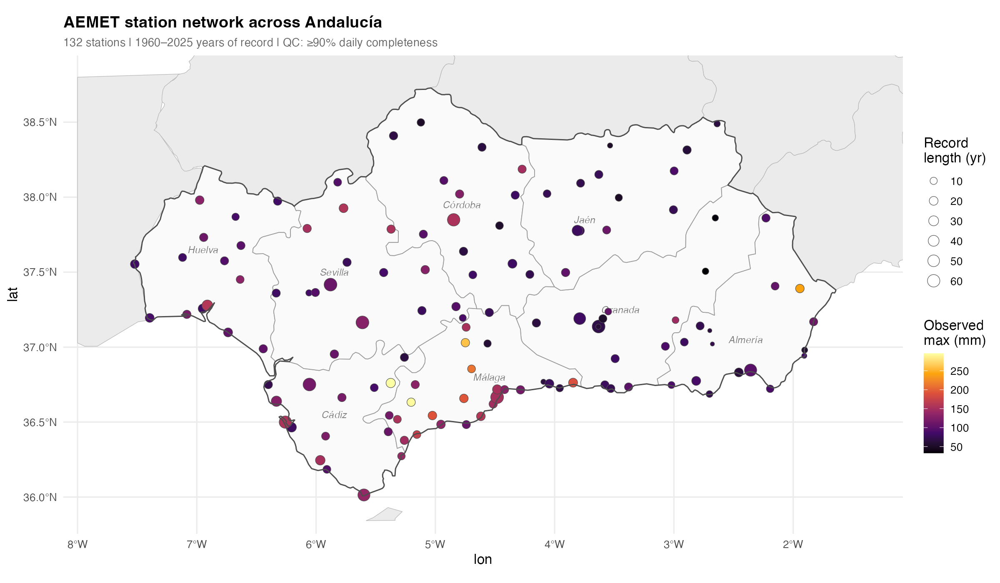
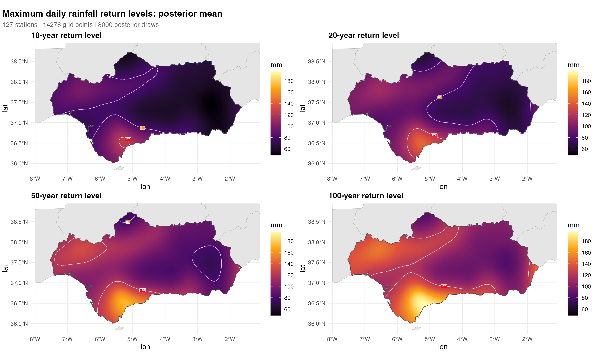
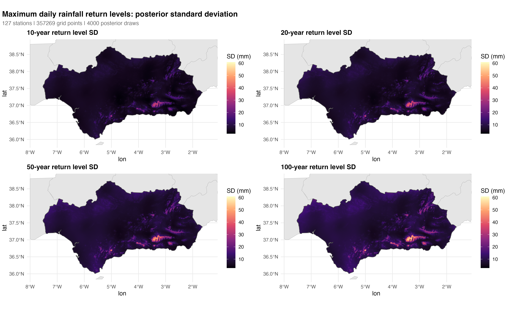
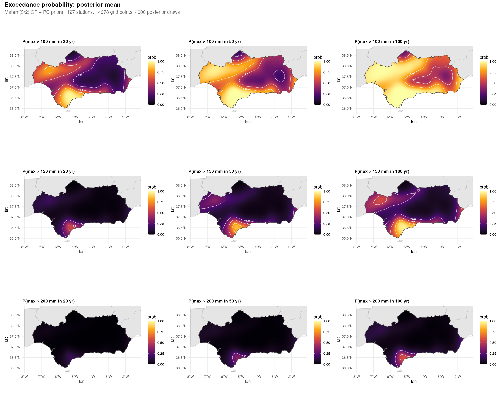
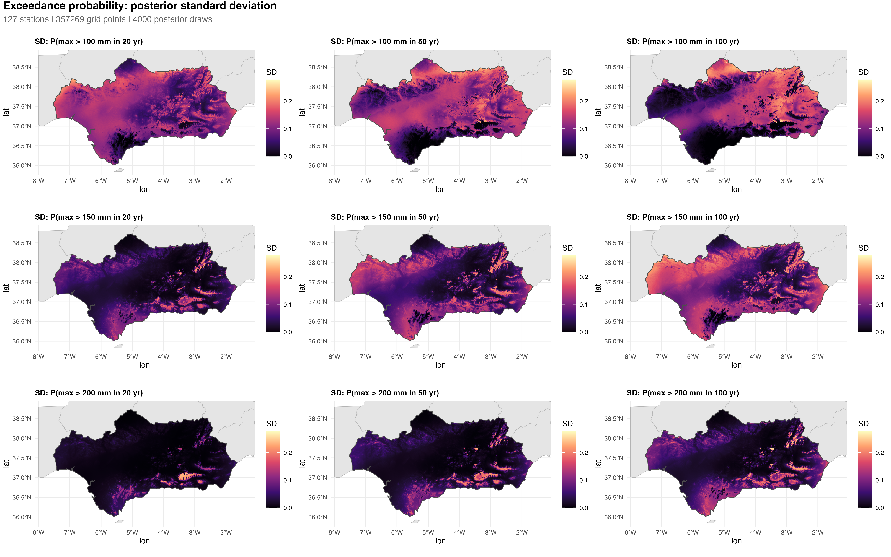
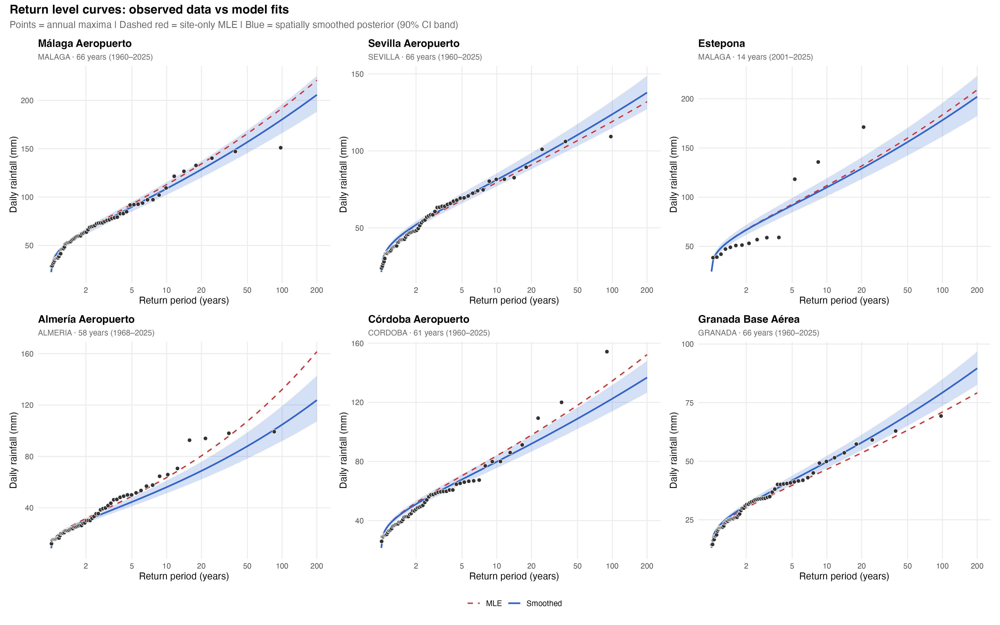

🇬🇧 English | [🇪🇸 Español](README.es.md)

# Spatial Extreme Precipitation in Andalucía

Bayesian spatial extreme value analysis of daily precipitation across Andalucía, Spain, using the **Max-and-Smooth** two-stage framework with Matérn(5/2) Gaussian process spatial smoothing and penalised complexity (PC) priors.

## Introduction

Extreme daily precipitation is a key input for flood risk assessment, infrastructure design, and water resource planning. Estimating how rare a given rainfall event is — and how that rarity varies across space — requires fitting statistical models to observed data. When individual station records are short or sparse, site-by-site estimates can be noisy and spatially inconsistent.

The goal of this project is to provide spatially continuous estimates of **return levels** (the rainfall amount expected to be exceeded on average once every *T* years) and **exceedance probabilities** (the chance of exceeding a critical threshold within a planning horizon) across Andalucía, to support flood risk assessment and hydrological planning in the region. Using daily precipitation records from 127 AEMET stations, the two-stage **Max-and-Smooth** framework (Hrafnkelsson et al., 2021) fits a GEV distribution at each station independently, then borrows strength across stations through a Matérn Gaussian process prior, producing spatially coherent maps with full uncertainty quantification.

## Data

- **Source**: AEMET (Agencia Estatal de Meteorología) OpenData API
- **Coverage**: 127 stations across all 8 provinces of Andalucía
- **Period**: 1950–2024 (varies by station; minimum record length governed by Bayesian borrowing of strength)
- **QC**: Station-years require ≥90% daily completeness (≥330 days/year)



## Method

The analysis follows the **Max-and-Smooth** approach of Hrafnkelsson et al. (2021) as presented in Hazra, Huser & Jóhannesson (2023, Ch. 7). Annual maximum daily rainfall at each station is modelled by a generalised extreme value (GEV) distribution whose parameters vary smoothly across space through Gaussian process priors.

### GEV model and reparametrisation

The GEV distribution function is

$$F(z) = \exp\left[-\left(1 + \xi \left(\frac{z - \mu}{\sigma}\right)\right)^{-1/\xi}\right]$$

with location $\mu$, scale $\sigma > 0$, and shape $\xi$. The parameters are reparametrised as

$$(\psi, \tau, \phi) = (\log(\mu), \log(\sigma / \mu), h(\xi))$$

where $h$ is a smooth bijection mapping $\xi \in (-0.5, 0.5)$ to the real line:

$$h(\xi) = a + b \cdot \log(-\log(1 - u^c)),\quad u = \frac{\xi - \xi_{\min}}{\xi_{\max} - \xi_{\min}}$$

with constants $c = 0.8$, $a$ and $b$ chosen so that $h(0) \approx 0$. This ensures all three working parameters are unbounded, which is essential for the Gaussian surrogate likelihood and the GP prior in Stage 2.

### Stage 1 — Site-wise maximum likelihood

At each station, a Poisson point process (PPP) likelihood is maximised over daily observations exceeding a site-specific threshold (the 75th percentile of positive precipitation). Multi-start optimisation over five initial shape values avoids local optima, with interior solutions ($\xi$ away from the bounds) preferred over boundary solutions to ensure reliable Hessians.

A parametric bootstrap (1000 replicates per station) provides per-station 3 × 3 covariance matrices $\hat\Sigma_i$ for the surrogate Gaussian likelihood used in Stage 2. Exceedances are simulated from the fitted PPP model and re-estimated, yielding empirical covariances of the MLE across replicates.

### Stage 2 — Spatial smoothing with covariates

The Stage 1 estimates $\hat\eta_i = (\hat\psi_i, \hat\tau_i, \hat\phi_i)$ are treated as noisy observations of a latent spatial field. Following Hazra, Huser & Jóhannesson (2023, Ch. 7), the three reparametrised GEV parameters receive different spatial structures:

$$\eta_\psi(s) = \mathbf{x}(s)^\top \boldsymbol{\beta}_\psi + f_\psi(s)$$
$$\eta_\tau(s) = \mu_\tau + f_\tau(s)$$
$$\eta_\phi(s) = \mu_\phi + f_\phi(s)$$

The **location parameter** $\psi$ includes covariates and a spatial GP; the **scale ratio** $\tau$ has an intercept and spatial GP; the **shape parameter** $\phi$ has an intercept and spatial GP with tighter PC priors reflecting the smaller spatial variation in the shape parameter.

#### Covariates on location ($\psi$)

The design matrix $\mathbf{X}$ includes an intercept and three covariates derived from SRTM elevation data:

| Covariate | Description |
|-----------|-------------|
| Altitude (DEM) | Elevation from SRTM 90 m DEM, standardised |
| Windward exposure | Mean orographic exposure from Mediterranean SE (135°) and Atlantic WSW (255°) wind directions, computed over 20 km transects |
| Altitude × Exposure | Interaction capturing enhanced orographic precipitation at elevated exposed sites |

Altitude and exposure are standardised to zero mean and unit variance at the station locations. Windward exposure at each station is computed as the difference between the station's elevation and the mean elevation along a 20 km upwind transect sampled from the DEM (see `R/10_dem_exposure.R`).

#### Matérn(5/2) Gaussian process

The spatial random effects $f_\psi$, $f_\tau$, and $f_\phi$ each receive an independent Matérn(5/2) GP prior:

$$C_k(d) = \sigma_k^2 \left(1 + \frac{\sqrt{5} d}{\rho_k} + \frac{5 d^2}{3 \rho_k^2}\right) \exp\left(-\frac{\sqrt{5} d}{\rho_k}\right)$$

where $d$ is inter-station distance (in degrees), $\sigma_k$ is the marginal standard deviation, and $\rho_k$ is the practical range. A nugget term $\nu_k^2$ is added to the diagonal to absorb station-specific noise not captured by the spatial GP.

#### Surrogate likelihood

The Stage 1 bootstrap covariances form a block-diagonal precision matrix $Q$ with 3 × 3 blocks $\hat\Sigma_i^{-1}$. The surrogate likelihood is

$$\hat{\eta} \mid \eta \sim \mathcal{N}(\eta, Q^{-1})$$

which decouples the computationally expensive per-station PPP fits from the spatial smoothing.

#### Non-centered parameterisation

To improve HMC sampling efficiency, all three GPs are parameterised as $\eta_k = \mu_k + L_k z_k$, where $L_k$ is the Cholesky factor of the covariance matrix and $z_k \sim \mathcal{N}(0, I)$.

#### Penalised complexity priors

Following Fuglstad et al. (2019), the GP hyperparameters receive PC priors. The $\psi$ and $\tau$ GPs share one calibration; the $\phi$ GP receives tighter priors reflecting the smaller spatial variation in the shape parameter:

| Parameter | $\psi$, $\tau$ | $\phi$ |
|-----------|----------------|--------|
| $\sigma_k$ (marginal SD) | $P(\sigma > 1) = 0.05 \Rightarrow \lambda_\sigma = 3.0$ | $P(\sigma > 0.3) = 0.05 \Rightarrow \lambda_\sigma = 10.0$ |
| $\rho_k$ (range) | $P(\rho < 0.1°) = 0.05 \Rightarrow \lambda_\rho = 0.30$ | $P(\rho < 0.5°) = 0.05 \Rightarrow \lambda_\rho = 1.50$ |
| $\nu_k$ (nugget SD) | $P(\nu > 0.5) = 0.05 \Rightarrow \lambda_\nu = 6.0$ | $P(\nu > 0.3) = 0.05 \Rightarrow \lambda_\nu = 10.0$ |

Covariate coefficients $\boldsymbol\beta_\psi$ receive vague priors $\mathcal{N}(0, 10^2)$; the intercepts $\mu_\tau$ and $\mu_\phi$ receive $\mathcal{N}(0, 100^2)$. The model is fitted jointly in Stan (Carpenter et al., 2017) using NUTS with 4 chains × 1000 iterations (1000 warmup), `adapt_delta = 0.9`.

### Prediction

Return levels and exceedance probabilities at unobserved locations are obtained by **sampling from the posterior predictive distribution** of the conditional GP. For each posterior draw, the predicted GEV parameters at a new location $s^*$ combine a covariate-driven mean with a spatially interpolated GP residual.

#### Covariate component

At each grid point, altitude and windward exposure are extracted from the DEM and used to form the prediction design matrix $\mathbf X(s^\ast)$. The covariate contribution to $\psi$ is $\mathbf x(s^\ast)^\top \boldsymbol\beta_\psi$, where $\boldsymbol\beta_\psi$ varies across posterior draws.

#### Clausius-Clapeyron altitude attenuation

The station network extends up to approximately 1500 m elevation, but grid points reach the summit of Mulhacén (3479 m). Below the highest station, the DEM altitude enters the design matrix directly. Above it, the altitude effect is attenuated using the **Clausius-Clapeyron moisture decay**:

```math
h_{\text{eff}}(h) = \begin{cases} h, & \text{if } h \le h_{\text{peak}} \\ h_{\text{peak}} + (h - h_{\text{peak}}) \cdot \exp\!\left(-\dfrac{h - h_{\text{peak}}}{H_w}\right), & \text{if } h > h_{\text{peak}} \end{cases}
```

where $h_{\text{peak}}$ is the altitude of the highest station and $H_w = 2000$ m is the atmospheric moisture scale height. This reflects the physical constraint that precipitable water decreases approximately exponentially with altitude, so the orographic enhancement of daily precipitation extremes — which Formetta et al. (2022) estimate at 7.5–10% per 1000 m for durations ≥ 8 h — must taper above the data range.

#### Spatial GP component

The GP hyperparameters $(\hat\sigma_k, \hat\rho_k, \hat\nu_k)$ are fixed at their posterior means to compute the conditional distribution of the GP residuals at $s^*$:

$$f_k(s^*) \mid f_k \sim \mathcal{N}(\mu_{\text{cond}}, \sigma^2_{\text{cond}})$$

where

$$\mu_{\text{cond}} = \boldsymbol{\gamma}_k^\top \boldsymbol{\Sigma}_k^{-1} \mathbf{f}_k, \qquad \sigma^2_{\text{cond}} = \sigma_k^2 - \boldsymbol{\gamma}_k^\top \boldsymbol{\Sigma}_k^{-1} \boldsymbol{\gamma}_k$$

with $\boldsymbol\gamma_k$ the cross-covariance vector between $s^\ast$ and the stations, and $\boldsymbol\Sigma_k$ the station-station covariance matrix (including nugget). For each posterior draw of the station-level residuals $\mathbf f_k$, a prediction is **sampled** from this conditional distribution, so the interpolation uncertainty $\sigma^2_{\text{cond}}$ is fully propagated into the posterior predictive GEV parameters.

#### Shape parameter ($\phi$)

The shape parameter $\phi$ receives the same conditional GP prediction as $\psi$ and $\tau$, using the $\phi$-specific GP hyperparameters $(\sigma_\phi, \rho_\phi, \nu_\phi)$. This preserves the observed east-west gradient in the GEV shape parameter, which reflects heavier-tailed Mediterranean convective precipitation in eastern Andalucía.

#### Grid

Predictions are computed on a 0.005° (~500 m) grid across Andalucía. Grid-level altitude and windward exposure are precomputed from the SRTM DEM (`R/11_grid_covariates.R`).

## Results

### Return level maps

Posterior mean return levels at *T* = 10, 20, 50, and 100 years, interpolated across Andalucía on a 0.005° grid.



Posterior standard deviation of the return level estimates, reflecting uncertainty from both the GEV parameter estimation and the spatial interpolation.



### Exceedance probability

Posterior mean probability that the annual maximum daily rainfall exceeds a given threshold (100, 150, 200 mm) at least once within a planning horizon (20, 50, 100 years).



Posterior standard deviation of the exceedance probabilities, capturing uncertainty in both the tail behaviour and the spatial prediction.



### Station diagnostics

Return level curves at 6 selected stations. Points show observed annual maxima (Gringorten plotting positions). The dashed red line is the site-only MLE fit; the solid blue line is the spatially smoothed posterior mean with 90% credible band.



## Dependencies

- **R** (≥ 4.2)
- **Stan**: [CmdStan](https://mc-stan.org/cmdstanr/) (≥ 2.33)
- **R packages**: cmdstanr, bayesplot, ggplot2, patchwork, sf, terra, rnaturalearth, rnaturalearthdata, dplyr, lubridate, Matrix, climaemet

## Pipeline

Pre-computed results are in `data/stage1_results.rds` and `data/stage2_matern_pc_results.rds` (gitignored; regenerate with steps 2–3 below).

```bash
Rscript R/00_station_map.R          # Station network map (Figure 0)
Rscript R/01_acquire_data.R         # Download AEMET daily precipitation
Rscript R/02_stage1_mle.R           # Stage 1: per-station PPP GEV MLEs (~10 min)
Rscript R/10_dem_exposure.R         # DEM download + station windward exposure
Rscript R/03_stage2_smooth.R        # Stage 2: spatial GP smoothing in Stan (~45 min)
Rscript R/11_grid_covariates.R      # Precompute altitude + exposure on prediction grid
Rscript R/04_return_level_maps.R    # Return level maps (Figure 1)
Rscript R/05_exceedance_maps.R      # Exceedance probability maps (Figure 2)
Rscript R/06_station_diagnostics.R  # Station return level curves (Figure 3)
Rscript R/07_convergence_diagnostics.R  # MCMC convergence diagnostics (diagnostics/)
Rscript R/08_spanish_figures.R      # Figuras en español (figures/es/)
```

## References

- Hrafnkelsson, B., Siegert, S., Huser, R., Bakka, H. & Jóhannesson, Á. V. (2021). Max-and-Smooth: a two-step approach for approximate Bayesian inference in latent Gaussian models. *Bayesian Analysis*, 16(2), 611–638. [doi:10.1214/20-BA1219](https://doi.org/10.1214/20-BA1219)

- Hazra, A., Huser, R. & Jóhannesson, Á. V. (2023). Bayesian spatial modelling of extreme precipitation return levels. In: Hrafnkelsson, B. (ed.) *Bayesian Latent Gaussian Models*. Chapman & Hall/CRC, Ch. 7. [doi:10.1007/978-3-031-39791-2_7](https://doi.org/10.1007/978-3-031-39791-2_7)

- Fuglstad, G.-A., Simpson, D., Lindgren, F. & Rue, H. (2019). Constructing priors that penalize the complexity of Gaussian random fields. *Journal of the American Statistical Association*, 114(525), 445–452. [doi:10.1080/01621459.2017.1415907](https://doi.org/10.1080/01621459.2017.1415907)

- Formetta, G., Marra, F. & Dallan, E. (2022). Modelling the dependence between short-duration precipitation intensity and duration as a function of altitude. *International Journal of Climatology*, 42, 3268–3282. [doi:10.1002/joc.7418](https://doi.org/10.1002/joc.7418)

- Carpenter, B. et al. (2017). Stan: A probabilistic programming language. *Journal of Statistical Software*, 76(1). [doi:10.18637/jss.v076.i01](https://doi.org/10.18637/jss.v076.i01)

## Acknowledgements

The Stage 2 Stan implementation — in particular the sparse Cholesky surrogate likelihood (`normal_prec_chol_lpdf`) and the non-centered spatial parameterisation — is adapted from Brynjólfur Gauti Guðmundsson's [maxandsmooth](https://github.com/bgautijonsson/maxandsmooth) R package. The Stage 1 fitting code (`vendor/max_and_smooth/`) is from the companion repository to Hazra, Huser & Jóhannesson (2023): [arnabstatswithR/max_and_smooth](https://github.com/arnabstatswithR/max_and_smooth).
